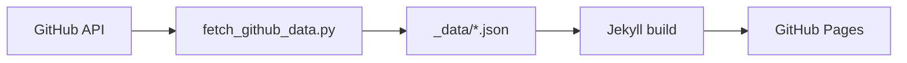

# viktorpm.github.io

Personal site powered by Jekyll and the Minima theme, deployed on GitHub Pages. Dynamic content (profile, organizations, repositories) is sourced from the GitHub GraphQL API and stored in Jekyll `_data` files.

## What is Jekyll?

Jekyll is a static site generator. It takes Markdown, Liquid templates, and data files, and produces a static website in `_site/`. GitHub Pages can build and serve Jekyll sites automatically from your repository.

Key concepts:
- **Pages/Posts**: Markdown files with front matter (e.g., `index.md`).
- **Layouts/Includes**: Provided by the theme; you reference them via front matter.
- **Data files**: YAML/JSON/CSV in `_data/`, available as `site.data.*` in templates.

## What is Minima?

[Minima](https://github.com/jekyll/minima) is Jekyll's default theme that provides clean layouts, navigation, and sensible defaults. This site uses the `page` layout for all pages with built-in navigation.

Configured via:
- `_config.yml`: sets the theme and site metadata
- No additional gems required (GitHub Pages supported)

## How the GitHub data integration works

1. `scripts/fetch_github_data.py` calls the GitHub GraphQL API.
2. The script writes JSON to `_data/`:
   - `_data/github_profile.json`
   - `_data/orgs.json`
   - `_data/repos.json`
3. Pages render that data with Liquid, e.g. `{{ site.data.github_profile.login }}`.



## Repository layout

- `_config.yml` — Jekyll configuration (theme, site metadata, footer content)
- `_data/` — GitHub data files (`github_profile.json`, `orgs.json`, `repos.json`)
- `index.md` — Home/About landing page (uses `site.data.github_profile.*`)
- `projects.md` — Projects listing (uses `site.data.repos.*`)
- `organizations.md` — Organizations listing (uses `site.data.orgs.*`)
- `scripts/fetch_github_data.py` — Fetches GitHub data via GraphQL API
- `Gemfile`, `Gemfile.lock` — Ruby dependencies for Jekyll
- `.gitignore` — Excludes build artifacts (`_site/`, `vendor/`, etc.)

## Local development

1. Install Ruby gems:
   ```bash
   bundle install
   ```
2. Fetch data (requires a GitHub token with `read:user`, `read:org` scopes):
   ```bash
   GH_TOKEN=xxxx GH_USER=viktorpm python3 scripts/fetch_github_data.py
   ```
3. Serve the site locally:
   ```bash
   bundle exec jekyll serve
   ```
   Visit http://127.0.0.1:4000

Notes:
- `_site/` is generated output and not committed.
- If you change `_config.yml` or theme, restart the server.

## Deployment (GitHub Pages)

This repository is a GitHub Pages site. When you push to the default branch:
- GitHub Pages builds the site with Jekyll and Minima theme
- Output is served at `https://<username>.github.io/`

No manual deployment is required. Ensure `_site/` and `vendor/` are not committed (they are in `.gitignore`).