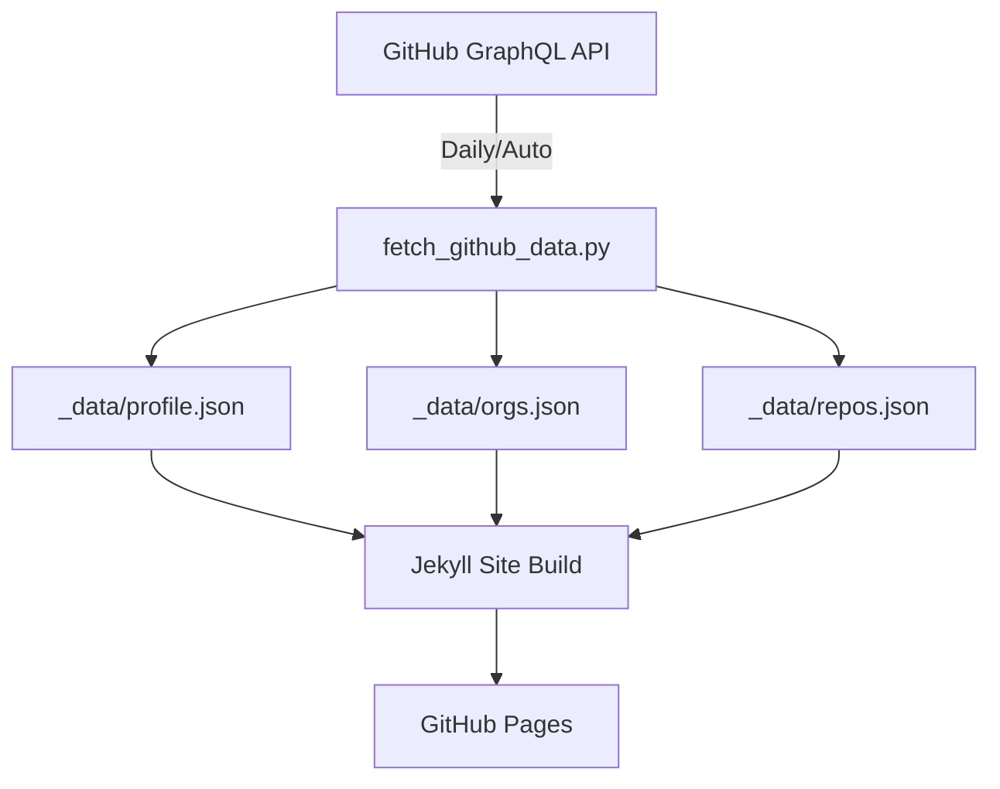

# viktorpm.github.io

A personal GitHub Pages site built with Jekyll that dynamically displays GitHub profile information, organizations, and repositories using the GitHub GraphQL API.

## Architecture Overview

This repository uses a simplified, robust architecture built on GitHub Pages native themes and minimal customizations:

> **Note**: This simplified approach uses `jekyll-theme-minimal` with inline styling to ensure maximum compatibility and reliability on GitHub Pages.

```
viktorpm.github.io/
├── 📁 Data Pipeline
│   ├── scripts/fetch_github_data.py  # GitHub API data fetcher (CI + local modes)
│   └── _data/                   # Generated JSON data files
├── 📁 Jekyll Core
│   ├── _config.yml              # Site configuration (minimal theme)
│   ├── index.md                 # Main page content (with inline styles)
│   └── Gemfile                  # Ruby dependencies
└── 📁 Automation
    └── .github/workflows/update.yml  # CI/CD pipeline
```

## How It Works

### 1. Data Flow



**Data Sources:**
- **Profile Data**: User name, bio, location, avatar, etc.
- **Organizations**: Organizations the user belongs to
- **Repositories**: Pinned repos and recently updated repos

### 2. Component Architecture

#### Frontend (Jekyll + Minimal Theme)
- **Base Theme**: `jekyll-theme-minimal` (GitHub Pages native)
- **Custom Styling**: Inline CSS for reliability and simplicity
- **Layout**: Single-page design with hero section and organized content blocks

#### Data Layer
- **Python Script**: `scripts/fetch_github_data.py`
  - Automatic token detection (CI vs local modes)
  - Graceful error handling for insufficient API scopes
  - Generates structured JSON data for Jekyll consumption

#### Build System
- **Jekyll**: Static site generator with minimal theme
- **No Custom CSS Pipeline**: Uses inline styles for maximum compatibility
- **GitHub Actions**: Automated build and deployment

## File Structure & Responsibilities

### Core Configuration

**`_config.yml`** - Jekyll site configuration
```yaml
# Site metadata and Jekyll settings
# Minima theme configuration
# Plugin setup (jekyll-feed, jekyll-sitemap)
```

**`Gemfile`** - Ruby dependencies
```ruby
# github-pages gem for GitHub Pages compatibility
# webrick for Ruby 3+ support
```

### Styling Architecture

**`assets/css/main.scss`** - Main CSS entry point
```scss
@import "minima";        // Base theme
@import "custom";        // Our custom styles
```

**`_sass/_custom.scss`** - Custom styles extending minima
- Clean, maintainable CSS without `!important` overrides
- Proper section organization with documentation
- Dark mode and responsive design support

### Data Pipeline

**`scripts/fetch_github_data.py`** - GitHub API integration
```python
# Features:
# - Interactive token prompting (secure)
# - Graceful scope error handling
# - Modular GraphQL queries
# - Robust error reporting
```

Generated data files:
- `_data/profile.json` - User profile information
- `_data/orgs.json` - Organization membership data
- `_data/repos.json` - Repository data (pinned + recent)

### Content Structure

**`index.md`** - Main page template
```liquid
<!-- Hero section with profile display -->
<!-- Organizations grid -->
<!-- Featured projects grid -->
<!-- Recently updated list -->
```

### Automation

**`.github/workflows/update.yml`** - CI/CD pipeline
```yaml
# Triggers: push, manual, daily schedule
# Steps:
#   1. Fetch fresh GitHub data
#   2. Build Jekyll site
#   3. Deploy to GitHub Pages
```

## Key Features

### 🔐 Security
- Interactive token prompting (no hardcoded secrets)
- Proper `.gitignore` for sensitive files
- Repository secrets for CI/CD

### 🎨 Design
- Clean, professional aesthetic
- Responsive design for all devices
- Dark mode support via CSS media queries
- Consistent typography and spacing

### 🛠️ Maintainability
- No fragile theme overrides or `!important` hacks
- Well-documented code with clear section headers
- Proper Jekyll asset pipeline usage
- Modular SCSS architecture

### ⚡ Performance
- Static site generation for fast loading
- Optimized CSS with proper imports
- GitHub Pages native hosting

### 🔄 Automation
- Daily content updates via GitHub Actions
- Manual deployment triggers
- Automated dependency management

## Setup & Usage

### Local Development

1. **Clone and setup dependencies**:
   ```bash
   git clone https://github.com/viktorpm/viktorpm.github.io.git
   cd viktorpm.github.io
   bundle install
   ```

2. **Fetch initial data**:
   ```bash
   python3 scripts/fetch_github_data.py
   # Enter your GitHub token when prompted
   ```

3. **Run locally**:
   ```bash
   bundle exec jekyll serve
   # Site available at http://127.0.0.1:4000
   ```

### Production Deployment

The site automatically deploys to GitHub Pages via GitHub Actions when:
- Code is pushed to the `main` branch
- Workflow is manually triggered
- Daily schedule runs (3:17 UTC)

### Required Setup

1. **GitHub Repository Secret**: 
   - Go to repo Settings → Secrets and variables → Actions
   - Add `GH_TOKEN` with a GitHub Personal Access Token
   - Required scopes: `read:user`, `read:org`, `repo`

2. **GitHub Pages**: 
   - Enable Pages in repository settings
   - Select "GitHub Actions" as source

## Maintenance Guide

### Adding New Content Types
1. Update `fetch_github_data.py` with new GraphQL query
2. Add corresponding JSON data structure
3. Update `index.md` template to display new data
4. Add styles in `_sass/_custom.scss` if needed

### Styling Changes
- Edit `_sass/_custom.scss` for custom styles
- Follow existing section organization
- Test in both light and dark modes

### Updating Dependencies
- Modify `Gemfile` for Ruby gems
- Update Python script dependencies as needed
- Test locally before pushing changes

## Technology Stack

- **Jekyll**: Static site generator
- **Minima Theme**: Jekyll's default theme (extended)
- **SCSS**: CSS preprocessing
- **Python**: GitHub API data fetching
- **GitHub GraphQL API**: Data source
- **GitHub Actions**: CI/CD automation
- **GitHub Pages**: Hosting platform

## Repository Status

The repository is currently in a clean, maintainable state:

- ✅ **No leftover files**: Removed duplicate CSS files and fragile overrides
- ✅ **Proper SCSS architecture**: Uses `_sass/_custom.scss` with `main.scss` entry point
- ✅ **Clean includes**: No custom template overrides in `_includes/` or `_layouts/`
- ✅ **Well-documented**: All files have clear headers and comments
- ✅ **Security**: Interactive token prompting, proper `.gitignore`

## Contributing

This is a personal site, but the architecture is designed for maintainability. Key principles:
- Keep customizations clean and documented
- Avoid theme overrides that could break on updates
- Use proper Jekyll extension mechanisms
- Maintain security best practices for API tokens
